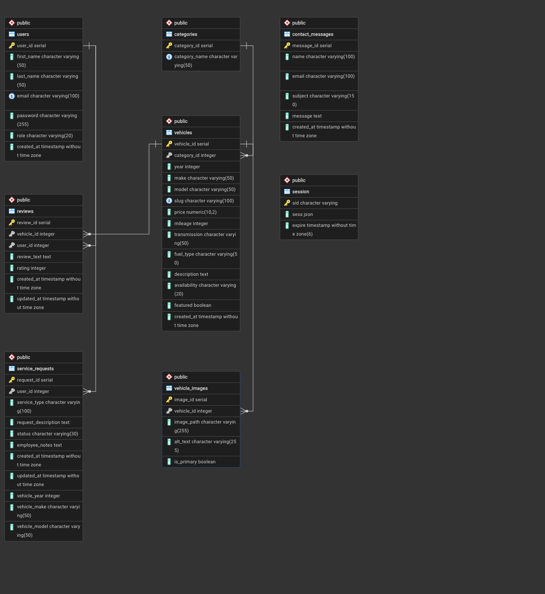

# cse340-dealership-inskeep
Used Car Dealership

## Render: 
https://cse340-dealership-inskeep.onrender.com

# Disclaimer: 
I did not write any of the CSS. All of the CSS is AI generated. I also used AI to help with wording on the frontend side. I wanted my text to sound professional.

# Project Description: 
My site is built for a used car dealership. It allows customers to browse vehicle inventory, view listings, leave reviews, and submit service requests. Employees and owners have access to admin tools for managing inventory, reviews, service requests, and system data.

# Database Schema: 

# User Roles: 
### Standard User
- Register and log in
- Browse vehicles and categories
- View vehicle details
- Leave, edit, and delete reviews
- Submit service requests
- View service request history and status

### Employee
- Moderate and delete reviews
- View and manage service requests
- Update service request status (Submitted, In Progress, Completed)
- Add notes to service requests
- View contact form submissions

### Owner (Admin)
- All employee permissions
- Add, edit, and delete vehicle categories
- Add, edit, and delete vehicles
- View dashboard with system data (users, vehicles, reviews, service requests, contact messages)

# Test Account Credentials: 
### Customer
Email: customer@demo.com  

### Employee
Email: employee@demo.com  

### Owner
Email: owner@demo.com  

# Known Limitations: 
- Employees do not fully manage vehicle inventory (handled by owner role)
- Image uploads are not dynamic (images are stored locally and referenced by path)